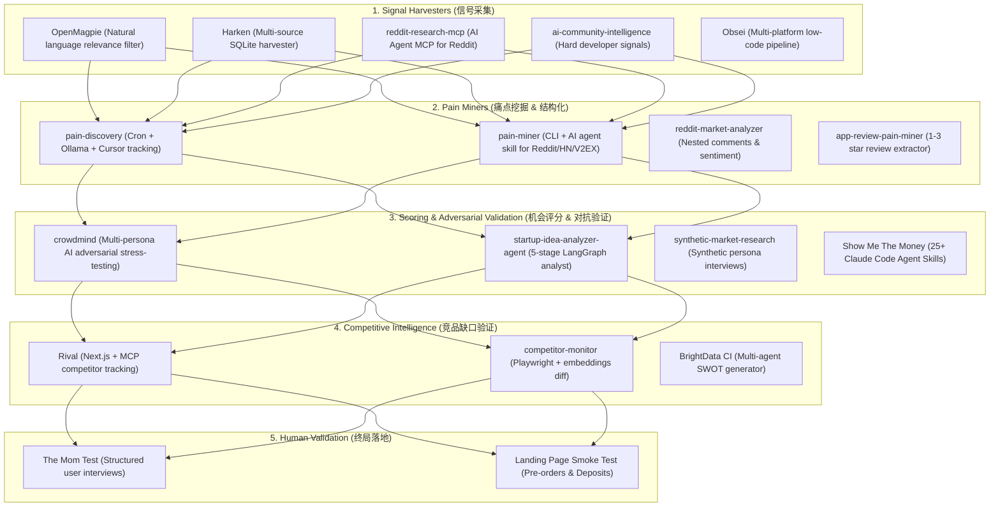

# Open-Source Demand Radar Ecosystem & Tool Stack Guide (`tool-stack.md`)

> A curated breakdown of open-source tools, MCP servers, and agent frameworks available in 2024–2026 to power each stage of the **Signal → Pain → Evidence → Opportunity → Validation → Build** loop.

---

## 1. Architectural Map of the Ecosystem

---

## 2. Comprehensive Tool Directory by Layer

### Layer 1: Signal Harvesting (信号采集)

| Tool | License | Primary Sources | Key Strengths | Best Used For |
| :--- | :---: | :--- | :--- | :--- |
| **[Harken](https://github.com/VladUZH/harken)** | MIT | HN, Reddit, Bluesky, Mastodon, SO, X, RSS | Zero-config, local SQLite storage, built-in lexical sentiment + optional Ollama/OpenAI. | Baseline 24/7 ambient listener running on local Mac or cheap VPS. |
| **[OpenMagpie](https://github.com/obris-dev/openmagpie)** | Apache-2.0 | Reddit, HN, X, YouTube, RSS | Natural language prompt filtering: only passes posts that match semantic relevance criteria. | Filtering out spam, marketing shills, and non-actionable complaints. |
| **[reddit-research-mcp](https://github.com/dialog-tools/reddit-research-mcp)** | MIT | 20,000+ Subreddits | Native Model Context Protocol (MCP) server for Claude Code and Cursor. | On-demand targeted semantic search while coding in your IDE. |
| **[ai-community-intelligence](https://github.com/akshayturtle/ai-community-intelligence)** | MIT | Reddit, HN, GitHub, ArXiv, Job Boards | Monitors developer signals, commit frequency, package downloads, and organic tech gripes. | Deep B2B and developer tools signal mining. |
| **[Obsei](https://github.com/obsei/obsei)** | Apache-2.0 | Reddit, Twitter, App Stores | Mature low-code Observer $\rightarrow$ Analyzer $\rightarrow$ Informer pipeline. | Enterprise-scale pipeline with wide third-party connector support. |

---

### Layer 2: Pain Point Mining & Structuring (痛点抽取)

| Tool | License | Primary Sources | Key Strengths | Best Used For |
| :--- | :---: | :--- | :--- | :--- |
| **[pain-discovery](https://github.com/albertorsesc/pain-discovery)** | Open | Reddit, HN, X, Trustpilot | Cron scanning + cursor tracking (only processes new posts) $\rightarrow$ local Ollama extraction $\rightarrow$ clustering. | The closest existing automated pain radar engine (85% pipeline coverage). |
| **[pain-miner](https://github.com/AdvancingTitans/pain-miner)** | MIT | Reddit, HN, V2EX | CLI + Agent skill, login-free, full source traceability, persona mapping. | Quick manual or scripted audits of Chinese and English developer forums. |
| **[reddit-market-analyzer](https://github.com/Firstbober/reddit-market-analyzer)** | Open | Reddit (PRAW) | Deep nested comment thread parsing, friction point + buying intent signal extraction into SQLite. | Extracting buying intent signals from long Reddit debate threads. |
| **[app-review-pain-miner](https://github.com/the-ai-entrepreneur-ai-hub/app-review-pain-miner)** | Apify | App Store, Play Store, Trustpilot | Mines 1–3 star negative reviews for feature defects and unfulfilled user requests. | Finding consumer and mobile app opportunities from unhappy incumbent users. |

---

### Layer 3: Opportunity Scoring & AI Adversarial Validation (评分与对抗验证)

| Tool | License | Key Strengths | Best Used For |
| :--- | :---: | :--- | :--- |
| **[crowdmind](https://github.com/yasintoy/crowdmind)** | MIT | Multi-persona adversarial AI validation (Skeptic, Enterprise Buyer, Frugal Indie Hacker, Power User). Automated iterative hypothesis optimization. | Stress-testing opportunity clusters before talking to real humans. |
| **[startup-idea-analyzer-agent](https://github.com/04bhavyaa/startup-idea-analyzer-agent)** | Open | LangGraph 5-stage pipeline: TAM estimation $\rightarrow$ competitive landscape $\rightarrow$ social sentiment $\rightarrow$ 1-10 feasibility $\rightarrow$ Go/No-Go report. | Generating executive decision memos in Markdown/PDF. |
| **[synthetic-market-research](https://github.com/BayramAnnakov/synthetic-market-research)** | MIT | Synthetic persona generation + Semantic Similarity Ratio (SSR) testing for willingness to pay and pricing sensitivity. | Pre-interview practice runs and survey calibration. |
| **[Show Me The Money](https://github.com/iamzifei/show-me-the-money)** | Free | 25+ Claude Code agent skills: 5-filter opportunity scoring, 6-question demand verification, business model stress testing. | Direct integration into AI coding workflows. |

---

### Layer 4: Competitive Intelligence (竞品缺口分析)

| Tool | License | Key Strengths | Best Used For |
| :--- | :---: | :--- | :--- |
| **[Rival](https://github.com/tessak22/rival)** | MIT | Next.js dashboard + built-in MCP server. Monitors competitor pricing changes, changelog releases, job postings, and GitHub activity. | Ensuring the extracted pain point hasn't been quietly fixed in recent releases. |
| **[competitor-monitor](https://github.com/Keerthivasan-Venkitajalam/competitor-monitor)** | Apache-2.0 | Playwright headless automation + sentence embeddings to detect messaging and feature shifts while filtering out UI redesign noise. | Continuous monitoring of competitor landing pages. |
| **[BrightData CI](https://github.com/brightdata/competitive-intelligence)** | MIT | Multi-agent research system generating comprehensive automated SWOT and market landscape reports. | Broad competitive landscape sweeps. |

---

## 3. Recommended Combinations

### The "Zero-Cost Solo Hacker" Stack
- **Signal**: Harken (SQLite) + Reddit public RSS / JSON endpoints
- **Extraction**: Local Ollama (`qwen2.5:7b-instruct`) using `prompts/extract.md`
- **Scoring**: `prompts/score.md` automated script + SQLite storage
- **Validation**: Obsidian for pain cards + 10 Mom Test interviews

### The "Autonomous Cloud Radar" Stack
- **Signal**: OpenMagpie + reddit-research-mcp running on a $5 VPS
- **Extraction**: `pain-discovery` nightly cron with deep cursor tracking
- **Adversarial Check**: `crowdmind` running 4 adversarial persona checks
- **Alerts**: n8n workflow dispatching opportunities with score $\ge 75$ to a Telegram channel
